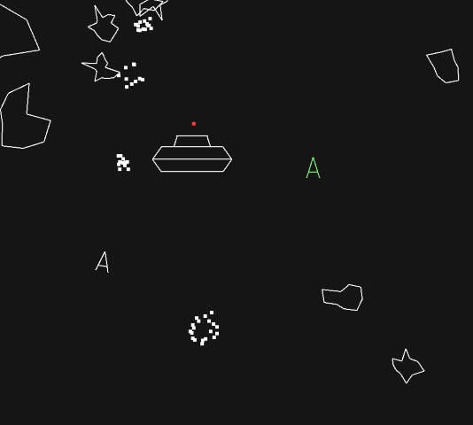

# Asteroids

A cooperative multiplayer asteroids game with both single-player and network play options.



## Compiling

The following dependencies are required:

-   SDL2
-   SDL2_ttf
-   SDL2_image
-   SDL2_mixer

## Installation

### Clone the repository

```
git clone https://github.com/Imn0/asteroids.git
cd asteroids
```

### Build

```
mkdir build && cd build
cmake ..
cmake --build .
```

### Platform specific steps:

#### Linux:

on Ubuntu/Debian install with
`apt install  libsdl2-dev libsdl2-image-dev libsdl2-mixer-dev libsdl2-ttf-dev`

on Arch
`pacman -S sdl2 sdl2_image sdl2_mixer sdl2_ttf`

#### Windows:

Using mingw (only singleplayer):

1. Install SDL2-mingw SDL2-ttf-mingw SDL2-image-mingw SDL2-mixer-mingw
2. Add instalation directories to to CMAKE_PREFIX_PATH or manually input the paths in the CMakeLists.txt

Using msvc:

1. Install SDL2-VC SDL2-ttf-VC SDL2-image-VC SDL2-mixer-VC
2. Add appropriate paths inside CMakeLists.txt

## Running the Game

### Linux

1. run server with `./asteroids -s`
2. run client with `./asteroids -c <server ip> <port>`
3. run single player with `./asteroids`

### Windows

1. run server with `./asteroids.exe server`
2. run client with `./asteroids.exe client <server ip> <port>`
3. run single player with `./asteroids.exe`
